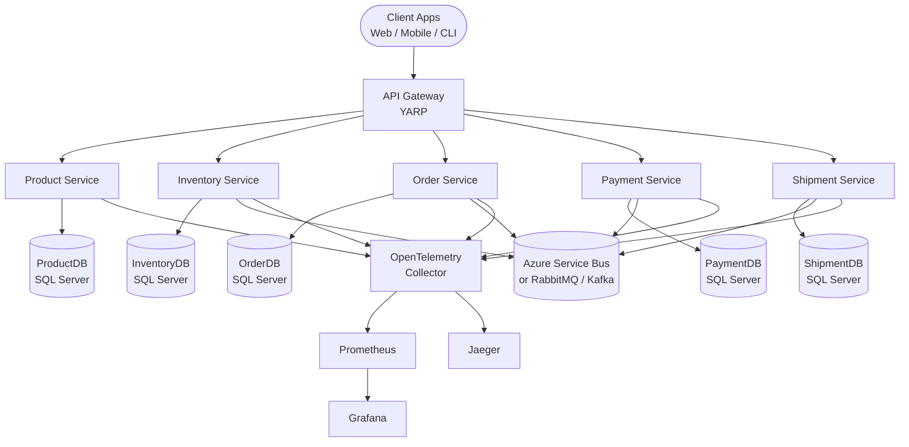
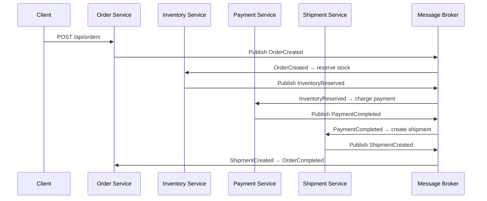
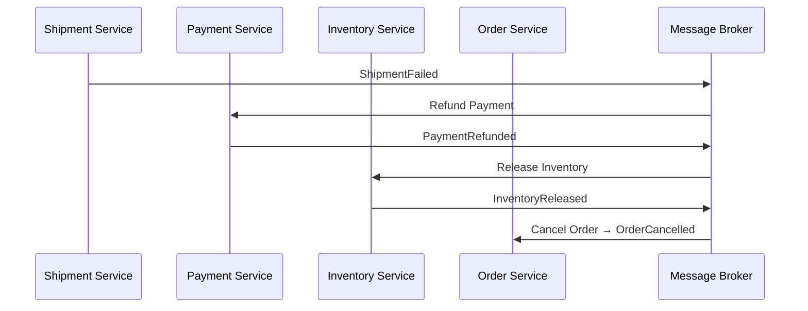

# E-Commerce Platform — Production-Ready Microservices

> A cloud-native, production-grade e-commerce backend built with **.NET 9**, **Clean Architecture**, **Domain-Driven Design (DDD)**, **CQRS**, and an **Event-Driven Saga** orchestration pattern. Designed as a reference architecture for teams building scalable microservices.

[](https://dotnet.microsoft.com)
[](LICENSE)
[](azure-devops-pipeline.yml)

---

## Table of Contents

1. [Architecture Overview](#architecture-overview)
2. [Technology Stack](#technology-stack)
3. [Project Structure](#project-structure)
4. [Prerequisites](#prerequisites)
5. [Quick Start — Docker Compose](#quick-start--docker-compose)
6. [Running Locally (Without Docker)](#running-locally-without-docker)
7. [Configuration Reference](#configuration-reference)
8. [Messaging Configuration](#messaging-configuration)
9. [Running Tests](#running-tests)
10. [Kubernetes Deployment](#kubernetes-deployment)
11. [Helm Deployment](#helm-deployment)
12. [CI/CD — Azure DevOps Pipeline](#cicd--azure-devops-pipeline)
13. [Observability](#observability)
14. [Security Model](#security-model)
15. [API Reference](#api-reference)
16. [Architecture Decisions (ADRs)](#architecture-decisions-adrs)
17. [Contributing](#contributing)
18. [License](#license)

---

## Architecture Overview



Each microservice has its **own isolated SQL Server database** (Database-per-Service pattern). Services communicate asynchronously via a pluggable message broker.

### Order Placement Saga



### Compensation Flow (on failure)



---

## Technology Stack

| Concern | Technology |
|---|---|
| Runtime | .NET 9 |
| API Framework | ASP.NET Core 9 |
| API Gateway | YARP (Yet Another Reverse Proxy) |
| ORM | Entity Framework Core 9 |
| Database | SQL Server 2022 |
| Messaging | Azure Service Bus / RabbitMQ / Kafka (pluggable) |
| CQRS Mediator | MediatR 12 |
| Input Validation | FluentValidation |
| Resilience | Polly v8 (retry, circuit-breaker, bulkhead) |
| Distributed Tracing | OpenTelemetry + Jaeger |
| Metrics | OpenTelemetry → Prometheus → Grafana |
| Structured Logging | Serilog |
| Authentication | OAuth2 / JWT Bearer / Azure AD (Entra ID) |
| Containerization | Docker (multi-stage, non-root) |
| Orchestration | Kubernetes + Helm |
| CI/CD | Azure DevOps Pipelines |

---

## Project Structure

```
ProductInventory/
├── src/
│   ├── ApiGateway/
│   │   └── ApiGateway/               # YARP reverse proxy + auth + rate limiting
│   ├── Services/
│   │   ├── ProductService/
│   │   │   ├── ProductService.API/          # Controllers, Program.cs, appsettings
│   │   │   ├── ProductService.Application/  # CQRS commands/queries, MediatR handlers
│   │   │   ├── ProductService.Domain/       # Aggregates, value objects, domain events
│   │   │   └── ProductService.Infrastructure/ # EF Core, repositories, outbox, messaging
│   │   ├── InventoryService/
│   │   │   ├── InventoryService.Application/
│   │   │   └── InventoryService.Domain/
│   │   ├── OrderService/
│   │   │   ├── OrderService.Application/    # Includes Saga orchestrator
│   │   │   └── OrderService.Domain/
│   │   ├── PaymentService/
│   │   │   ├── PaymentService.Application/
│   │   │   ├── PaymentService.Domain/
│   │   │   └── PaymentService.Infrastructure/
│   │   └── ShipmentService/
│   │       ├── ShipmentService.Domain/
│   │       └── ShipmentService.Infrastructure/
│   └── Shared/
│       ├── Shared.Domain/            # Base entities, value objects, Result<T>
│       ├── Shared.Contracts/         # Integration events, DTOs shared across services
│       └── Shared.Infrastructure/    # Messaging factory, Outbox processor, EF interceptors
├── tests/
│   ├── ProductService.UnitTests/
│   ├── ProductService.IntegrationTests/
│   ├── OrderService.UnitTests/
│   └── InventoryService.UnitTests/
├── deploy/
│   ├── docker/
│   │   ├── Dockerfile                # Multi-stage, parameterized for all services
│   │   ├── docker-compose.yml        # Full local dev stack
│   │   ├── otel-collector-config.yaml
│   │   └── prometheus.yml
│   ├── kubernetes/
│   │   └── manifests.yaml            # Namespace, Deployments, Services, HPA
│   └── helm/
│       └── ecommerce-platform/       # Helm chart with configurable values
├── docs/
│   ├── security-threat-model.md      # STRIDE + OWASP Top 10 analysis
│   └── adr/
│       └── architecture-decision-records.md
├── azure-devops-pipeline.yml
└── ProductInventory.sln
```

---

## Prerequisites

| Tool | Minimum Version | Notes |
|---|---|---|
| [.NET SDK](https://dotnet.microsoft.com/download) | 9.0 | Required for local development |
| [Docker Desktop](https://www.docker.com/products/docker-desktop) | 24.x | Required for Docker Compose |
| [Git](https://git-scm.com/) | 2.x | |
| SQL Server | 2022 | Provided via Docker; optional for local setup |
| [kubectl](https://kubernetes.io/docs/tasks/tools/) | 1.29+ | Only for Kubernetes deployment |
| [Helm](https://helm.sh/docs/intro/install/) | 3.x | Only for Helm deployment |

---

## Quick Start — Docker Compose

This is the fastest way to run the entire platform locally. Docker Compose starts all microservices, SQL Server, RabbitMQ, and the full observability stack.

### 1. Clone the repository

```bash
git clone https://github.com/your-org/ecommerce-platform.git
cd ecommerce-platform
```

### 2. Start the stack

```bash
docker compose -f deploy/docker/docker-compose.yml up -d --build
```

> The first run builds all service images. Subsequent runs use the cache and start in seconds.

### 3. Verify everything is running

```bash
docker compose -f deploy/docker/docker-compose.yml ps
```

All services should show status `healthy` or `running`.

### 4. Access the services

| Service | URL | Credentials |
|---|---|---|
| API Gateway | http://localhost:8080 | — |
| Product Service | http://localhost:8081 | — |
| Inventory Service | http://localhost:8082 | — |
| Order Service | http://localhost:8083 | — |
| RabbitMQ Management | http://localhost:15672 | `guest` / `guest` |
| Grafana | http://localhost:3001 | `admin` / `admin` |
| Prometheus | http://localhost:9090 | — |
| Jaeger UI | http://localhost:16686 | — |
| SQL Server | `localhost,1433` | `sa` / `Dev@1234!Strong` |

### 5. Health checks

```bash
curl http://localhost:8080/health    # API Gateway
curl http://localhost:8081/health    # Product Service
curl http://localhost:8082/health    # Inventory Service
curl http://localhost:8083/health    # Order Service
```

### 6. Tear down

```bash
docker compose -f deploy/docker/docker-compose.yml down -v
```

---

## Running Locally (Without Docker)

To run individual services directly with `dotnet run`, you need SQL Server and a message broker available (locally or via Docker).

### Step 1 — Start infrastructure only

```bash
# Start only SQL Server and RabbitMQ (no services)
docker compose -f deploy/docker/docker-compose.yml up -d sqlserver rabbitmq otel-collector prometheus grafana jaeger
```

### Step 2 — Configure environment variables

Each service reads its connection strings and secrets from environment variables or `appsettings.json`. For local dev, set these in your shell or use `dotnet user-secrets`.

```bash
# Example — Product Service
cd src/Services/ProductService/ProductService.API

dotnet user-secrets set "ConnectionStrings:ProductDb" "Server=localhost,1433;Database=ProductDb;User Id=sa;Password=Dev@1234!Strong;TrustServerCertificate=true"
dotnet user-secrets set "Messaging:Provider" "RabbitMQ"
dotnet user-secrets set "Messaging:RabbitMQ:HostName" "localhost"
dotnet user-secrets set "Messaging:RabbitMQ:UserName" "guest"
dotnet user-secrets set "Messaging:RabbitMQ:Password" "guest"
dotnet user-secrets set "OpenTelemetry:Endpoint" "http://localhost:4317"
```

For **Azure AD authentication** locally, you can bypass JWT validation by setting `ASPNETCORE_ENVIRONMENT=Development` — the services relax `RequireHttpsMetadata`. For full auth testing, see the [Configuration Reference](#configuration-reference).

### Step 3 — Apply database migrations

EF Core migrations run automatically on startup. To apply them manually:

```bash
# Product Service
dotnet ef database update \
  --project src/Services/ProductService/ProductService.Infrastructure \
  --startup-project src/Services/ProductService/ProductService.API
```

Repeat for each service that has an `Infrastructure` project with a `DbContext`.

### Step 4 — Run the services

Open separate terminals for each service:

```bash
# Terminal 1 — Product Service
dotnet run --project src/Services/ProductService/ProductService.API

# Terminal 2 — Inventory Service (once API project is added)
dotnet run --project src/Services/InventoryService/...

# Terminal 3 — API Gateway
dotnet run --project src/ApiGateway/ApiGateway
```

---

## Configuration Reference

Each service follows the **Twelve-Factor App** configuration principle: all config is read from environment variables or `appsettings.json`. Environment variables override file-based config using the `__` double-underscore separator (e.g., `ConnectionStrings__ProductDb`).

### Common settings (all services)

| Key | Description | Example |
|---|---|---|
| `ASPNETCORE_ENVIRONMENT` | Runtime environment | `Development`, `Production` |
| `OpenTelemetry:Endpoint` | OTLP gRPC endpoint for traces/metrics | `http://otel-collector:4317` |
| `Serilog:MinimumLevel:Default` | Log level | `Information` |
| `Cors:AllowedOrigins` | Allowed CORS origins (array) | `["http://localhost:3000"]` |

### Product Service (`src/Services/ProductService/ProductService.API/appsettings.json`)

| Key | Description | Required |
|---|---|---|
| `ConnectionStrings:ProductDb` | SQL Server connection string | Yes |
| `Auth:Authority` | Azure AD token issuer URL | Yes |
| `Auth:Audience` | Expected JWT audience | Yes |
| `Messaging:Provider` | `AzureServiceBus`, `RabbitMQ`, or `Kafka` | Yes |

### API Gateway (`src/ApiGateway/ApiGateway/appsettings.json`)

| Key | Description |
|---|---|
| `Auth:Authority` | Azure AD / OAuth2 issuer for JWT validation |
| `Auth:Audience` | `api://ecommerce-gateway` |
| `ReverseProxy:Routes` | YARP route table (path → cluster) |
| `ReverseProxy:Clusters` | Upstream service addresses |

### Auth — Azure AD (Entra ID) setup

To use real Azure AD JWT authentication:

1. Register an application in the [Azure Portal](https://portal.azure.com) → **Entra ID → App Registrations**.
2. Create one app registration per service (or use a single multi-tenant app).
3. Set the following values in each service's configuration:

```json
{
  "Auth": {
    "Authority": "https://login.microsoftonline.com/<YOUR_TENANT_ID>/v2.0",
    "Audience": "api://<YOUR_APP_ID_URI>"
  }
}
```

For **local development without Azure AD**, set the environment to `Development` and the services will accept unauthenticated requests (JWT metadata requirement is relaxed).

---

## Messaging Configuration

The messaging provider is **pluggable at runtime** — no code changes required. Set `Messaging:Provider` to switch backends.

### RabbitMQ (default for local dev / Docker Compose)

```json
{
  "Messaging": {
    "Provider": "RabbitMQ",
    "RabbitMQ": {
      "HostName": "localhost",
      "UserName": "guest",
      "Password": "guest"
    }
  }
}
```

Environment variables:
```bash
Messaging__Provider=RabbitMQ
Messaging__RabbitMQ__HostName=rabbitmq
Messaging__RabbitMQ__UserName=guest
Messaging__RabbitMQ__Password=guest
```

### Azure Service Bus (recommended for production)

```json
{
  "Messaging": {
    "Provider": "AzureServiceBus",
    "AzureServiceBus": {
      "ConnectionString": "<YOUR_SERVICE_BUS_CONNECTION_STRING>",
      "MaxRetryCount": 3,
      "MaxConcurrentCalls": 10,
      "EnableDeadLettering": true,
      "EnableDuplicateDetection": true
    }
  }
}
```

> **Security**: Never commit real connection strings. Use environment variables, Azure Key Vault, or .NET user-secrets.

### Kafka

```json
{
  "Messaging": {
    "Provider": "Kafka",
    "Kafka": {
      "BootstrapServers": "localhost:9092"
    }
  }
}
```

---

## Running Tests

The solution includes unit tests and integration tests.

### Run all tests

```bash
dotnet test ProductInventory.sln
```

### Run unit tests only

```bash
dotnet test ProductInventory.sln --filter "Category=Unit"
```

### Run integration tests only

> Integration tests require a running SQL Server instance and a message broker.

```bash
# Start infrastructure first
docker compose -f deploy/docker/docker-compose.yml up -d sqlserver rabbitmq

dotnet test ProductInventory.sln --filter "Category=Integration"
```

### With code coverage

```bash
dotnet test ProductInventory.sln \
  --collect:"XPlat Code Coverage" \
  --results-directory ./coverage

# Generate HTML report (requires reportgenerator tool)
dotnet tool install -g dotnet-reportgenerator-globaltool
reportgenerator -reports:"coverage/**/coverage.cobertura.xml" -targetdir:"coverage/report" -reporttypes:Html
```

### Test projects

| Project | Type | What it tests |
|---|---|---|
| `tests/ProductService.UnitTests` | Unit | Domain aggregates, value objects, CQRS handlers |
| `tests/ProductService.IntegrationTests` | Integration | API endpoints, EF Core, full HTTP pipeline |
| `tests/OrderService.UnitTests` | Unit | Order aggregate, saga state machine |
| `tests/InventoryService.UnitTests` | Unit | Inventory aggregate, reservation logic |

---

## Kubernetes Deployment

### Prerequisites

- A running Kubernetes cluster (AKS, minikube, kind, etc.)
- `kubectl` configured to target the cluster
- Container images built and pushed to a registry

### Step 1 — Build and push images

```bash
# Build and push each service image
REGISTRY=your-registry.azurecr.io

docker build --build-arg SERVICE_NAME=ProductService.API \
             --build-arg SERVICE_PATH=src/Services/ProductService/ProductService.API \
             -t $REGISTRY/product-service:latest \
             -f deploy/docker/Dockerfile .

docker push $REGISTRY/product-service:latest

# Repeat for: InventoryService, OrderService, PaymentService, ShipmentService, ApiGateway
```

### Step 2 — Create secrets

```bash
kubectl create namespace ecommerce

# Database connection strings
kubectl create secret generic product-db-secret \
  --from-literal=connection-string="Server=<host>;Database=ProductDb;User Id=sa;Password=<pwd>;TrustServerCertificate=true" \
  -n ecommerce

# Azure Service Bus (production)
kubectl create secret generic servicebus-secret \
  --from-literal=connection-string="<AZURE_SERVICE_BUS_CONNECTION_STRING>" \
  -n ecommerce
```

### Step 3 — Apply manifests

```bash
kubectl apply -f deploy/kubernetes/manifests.yaml
```

### Step 4 — Verify deployment

```bash
kubectl get pods -n ecommerce
kubectl get services -n ecommerce
```

### Step 5 — Access the API Gateway

```bash
kubectl get svc api-gateway -n ecommerce
# Use the EXTERNAL-IP shown
```

---

## Helm Deployment

Helm charts are provided for production-grade deployment with configurable replicas, autoscaling, and resource limits.

### Install the chart

```bash
helm upgrade --install ecommerce deploy/helm/ecommerce-platform \
  --namespace ecommerce \
  --create-namespace \
  --set global.imageRegistry=your-registry.azurecr.io \
  --set global.imageTag=1.0.0 \
  --set global.environment=production
```

### Override values

Create a `values-override.yaml` for your environment:

```yaml
global:
  imageRegistry: "your-registry.azurecr.io"
  imageTag: "1.2.3"
  environment: "staging"

productService:
  replicaCount: 3
  autoscaling:
    enabled: true
    minReplicas: 2
    maxReplicas: 10
    targetCPUUtilizationPercentage: 70

apiGateway:
  service:
    type: LoadBalancer
```

```bash
helm upgrade --install ecommerce deploy/helm/ecommerce-platform \
  -f values-override.yaml \
  --namespace ecommerce
```

### Uninstall

```bash
helm uninstall ecommerce --namespace ecommerce
```

---

## CI/CD — Azure DevOps Pipeline

The pipeline is defined in [`azure-devops-pipeline.yml`](azure-devops-pipeline.yml) and runs on pushes to `main`, `develop`, and `release/*` branches.

### Pipeline stages

| Stage | Steps |
|---|---|
| **Build & Test** | Restore, Build, Unit Tests, Integration Tests, Code Coverage |
| **Security Scan** | OWASP Dependency Check, Trivy container image scan |
| **Docker Build** | Multi-stage image build for all services |
| **Push Images** | Push to Azure Container Registry |
| **Deploy** | Helm upgrade to AKS |

### Required pipeline variables / secrets

Create a variable group named `ecommerce-secrets` in Azure DevOps with these keys:

| Variable | Description |
|---|---|
| `AZURE_CONTAINER_REGISTRY` | ACR registry name (without `.azurecr.io`) |
| `AZURE_SERVICE_BUS_CONNECTION_STRING` | Service Bus primary connection string |
| `AZURE_TENANT_ID` | Azure AD tenant ID |
| `KUBECONFIG` | Base64-encoded kubeconfig for AKS cluster |

---

## Observability

The platform ships with a full observability stack out of the box.

### Traces — Jaeger

Open **http://localhost:16686** to explore distributed traces. Every request flowing through the API Gateway and all downstream services is automatically instrumented via OpenTelemetry.

### Metrics — Prometheus + Grafana

- Prometheus scrapes metrics from all services at `/metrics` every 10 seconds.
- Open Grafana at **http://localhost:3001** (`admin` / `admin`).
- Add Prometheus as a data source: `http://prometheus:9090`.
- Import the official [ASP.NET Core dashboard](https://grafana.com/grafana/dashboards/19924) (ID `19924`).

### Logs — Serilog

All services emit structured JSON logs to stdout. In production, forward them to your preferred log aggregator (Azure Monitor, Elastic, Loki, etc.).

### OpenTelemetry Collector

The collector (defined in [`deploy/docker/otel-collector-config.yaml`](deploy/docker/otel-collector-config.yaml)) fans out:
- **Traces** → Jaeger (OTLP gRPC)
- **Metrics** → Prometheus (scrape endpoint `:8889`)

---

## Security Model

See the full threat model at [`docs/security-threat-model.md`](docs/security-threat-model.md).

### Summary of mitigations

| OWASP Risk | Mitigation |
|---|---|
| Broken Access Control | Policy-based authorization (`AdminPolicy`, `CustomerPolicy`) at gateway and per-service |
| Cryptographic Failures | TLS everywhere, JWT signed with RS256, SQL connections encrypted |
| Injection | EF Core parameterized queries only; FluentValidation at all API boundaries |
| Security Misconfiguration | Non-root Docker user; all Linux capabilities dropped; NetworkPolicy in K8s |
| Authentication Failures | JWT expiry enforced; 30s clock-skew tolerance; stateless APIs |
| Vulnerable Components | Automated OWASP Dependency Check + Trivy image scanning in CI pipeline |

### Rate limiting (API Gateway)

- **Global**: 100 requests/minute per user (sliding window)
- **Write operations**: Stricter policy on order creation endpoints
- Configurable in `Program.cs` / environment variables

### Secrets management

- **Local dev**: .NET User Secrets (`dotnet user-secrets`)
- **Docker**: Environment variables in `docker-compose.yml` (dev passwords only — never commit production secrets)
- **Production**: Azure Key Vault or Kubernetes Secrets

---

## API Reference

The API Gateway proxies all traffic. All routes require a valid JWT Bearer token unless marked public.

| Method | Path | Auth | Description |
|---|---|---|---|
| `GET` | `/api/v1/products` | Public | List products with search & pagination |
| `GET` | `/api/v1/products/{id}` | Public | Get product by ID |
| `POST` | `/api/v1/products` | Admin | Create a new product |
| `PUT` | `/api/v1/products/{id}/price` | Admin | Update product price |
| `GET` | `/api/v1/inventory/{productId}` | Authenticated | Get inventory levels |
| `POST` | `/api/v1/orders` | Authenticated | Place a new order (triggers Saga) |
| `GET` | `/api/v1/orders/{id}` | Authenticated | Get order status |
| `POST` | `/api/v1/payments` | Admin | Process a payment |
| `GET` | `/api/v1/shipments/{orderId}` | Authenticated | Get shipment status |

Swagger / OpenAPI docs are available at each service's `/swagger` endpoint in `Development` mode.

---

## Architecture Decisions (ADRs)

Key design decisions are documented in [`docs/adr/architecture-decision-records.md`](docs/adr/architecture-decision-records.md).

| ADR | Decision | Status |
|---|---|---|
| ADR-001 | Orchestrator-based Saga (vs Choreography) for order workflow | Accepted |
| ADR-002 | Pluggable `IEventBus` factory pattern for messaging providers | Accepted |

---

## Contributing

Contributions are welcome! Please follow these steps:

1. **Fork** the repository and create a feature branch from `develop`:
   ```bash
   git checkout -b feature/your-feature-name develop
   ```

2. **Follow the coding conventions**:
   - Clean Architecture layer boundaries must be respected (Domain has zero external dependencies)
   - All new domain logic must have unit tests
   - Use the `Result<T>` pattern for error handling — do not throw exceptions for domain errors
   - CQRS: commands go in `Application/[Entity]/Commands/`, queries in `Application/[Entity]/Queries/`

3. **Run tests before submitting**:
   ```bash
   dotnet test ProductInventory.sln
   ```

4. **Open a Pull Request** against `develop` with a description of what changed and why.

### Coding standards

- All public types and members have XML doc comments
- FluentValidation validators are required for all commands
- No `DbContext` is injected directly into application layer handlers — use repositories
- Log at `Information` for business events, `Warning` for recoverable failures, `Error` for unhandled exceptions

---

## License

This project is licensed under the **MIT License** — see the [LICENSE](LICENSE) file for details.
